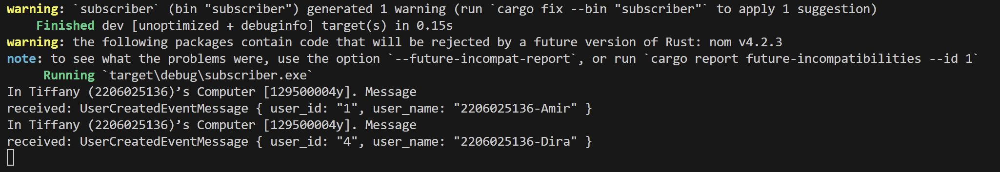
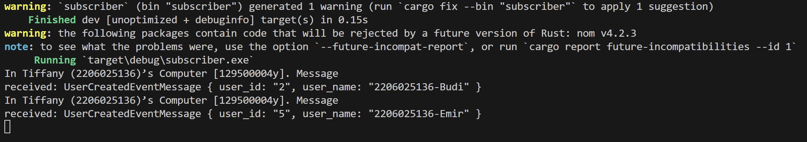
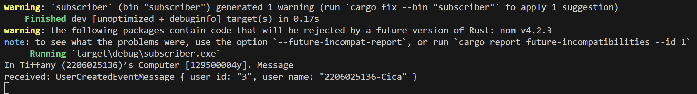
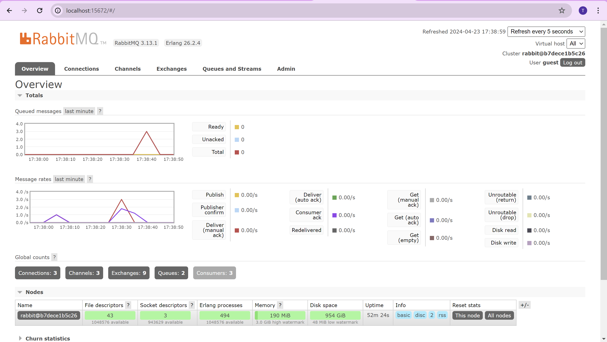

# Subscriber and message broker
1. what is amqp?  
    AMQP adalah singkatan dari Advanced Message Queuing Protocol. Protokol tersebut memampukan banyak aplikasi atau komponen berbeda untuk saling berkomunikasi dengan mengirimkan pesan secara asinkronus. AMPQ bersifat efisein, reliable, dan bisa dioperasikan di banyak macam platform dan bahasa pemrograman. Biasanya digunakan pada sistem yang terdistribusi. Terkhusus pada saat dibutuhkan antrian pesan yang reliable dan terukur antara komponen atau service yang berbeda.
2. what it means guest:guest@localhost:5672 , what is the first quest, and what is the second guest, and what is localhost:5672 is for?  
    guest pertama merupakan username yang digunakan pada autentikasi. guest kedua merupakan password dari autentikasi tersebut. Ini adalah default credentials yang digunakan saat setup untuk testing atau development awal. localhost:5672 bermaksud melakukan spesifikasi pada hostname dan port dari server. localhost yang dimaksud tentunya mesin lokal. Sementara, 5672 merupakan port default untuk komunikasi AMQP.

  

Pada ss diatas queue nya mencapai 20 juga. Ini dikarenakan simulasi diperlambat dan di run berulang sehingga memenuhi queue messages.

  

saya membuka tiga console, dan terlihat bahwa terpisah-pisah antara user 1 dan 4 kemudian ada yang 2 dan 5, dan yang terakhir 3 sendiri.

  

ini yang tampil saat di run berulang-ulang lagi, tampilannya lebih cepat turun queue nya. Ini dikarenakan terdapat 3 subscriber yang di run sekaligus sehingga lebih terbagi-bagi dan dieksekusi lebih cepat. Makanya queue nya cepat turun.